# StockMind — AI-Powered Financial Intelligence & Virtual Trading Platform

## Overview

**StockMind** is an AI-powered financial intelligence and virtual trading platform designed to help users explore global markets, analyze financial assets, understand news sentiment, and develop disciplined trading skills through simulation.

Unlike traditional financial dashboards that only display price data, StockMind integrates **real-time market data, AI-driven sector analysis (powered by Google Gemini), behavioral performance analytics, and virtual trading simulation** into a single unified ecosystem. The platform is built on a **dual-process architecture** — a Next.js frontend with API routes that proxy to a Python FastAPI backend — enabling robust data orchestration, caching, and AI processing.

The platform connects **market intelligence with behavioral learning**, enabling users to improve decision-making through structured evaluation, adaptive feedback, and gamified challenges.

> **Note:** StockMind is a strictly educational platform. It does not provide buy/sell recommendations, predict future prices, or facilitate real-money trading. All insights are informational and exploratory only.

---

## Tools & Technologies

### Frontend
- **Next.js 14** (App Router)
- **React 18** with **TypeScript 5**
- **Tailwind CSS 3.4** + **shadcn/ui** (Radix UI primitives)
- **Framer Motion 11** — animations and transitions
- **TradingView Lightweight Charts 4** — all financial charts
- **Heroicons** — icon system
- **date-fns** + **numeral** — date and number formatting

### Backend
- **Python FastAPI** — data orchestration and normalization server
- **SQLite** (via aiosqlite) — persistent storage for portfolios, alerts, watchlists, journals, and checklists
- **Uvicorn** — ASGI server

### Data Sources
- **yfinance** — primary stock data (quotes, historical OHLC, company info)
- **Alpha Vantage** — US stock prices (cached)
- **CoinGecko** — cryptocurrency market data
- **NSE (nsetools)** — Indian stock market data
- **NewsAPI** — financial news aggregation
- **Wikipedia** — company descriptions
- **Stooq** (via pandas-datareader) — historical data fallback

### AI & Analytics
- **Google Gemini** — sector classification, competitor discovery, chatbot,and contextual sentiment interpretation
- Behavioral scoring engine (30-day rolling evaluation)
- Adaptive mentorship system
- Divergence detection (price vs. sentiment)

### Development Tools
- **Node.js 18+** / npm
- **Python 3.8+** / pip
- **concurrently** — runs Next.js and Python server in parallel via `npm run dev`
- **ESLint** — code linting

---

## Application Pages & Features

---

### Home — Market Dashboard

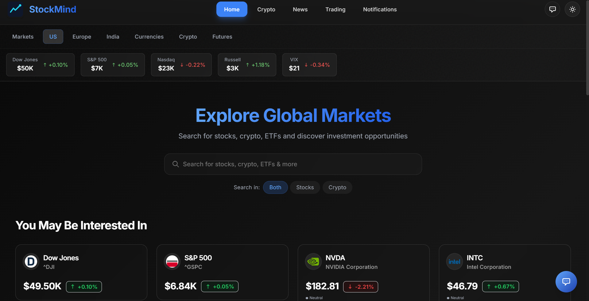

<p align="center"><b>Fig 1:</b> Market dashboard with unified search, market tabs, and asset discovery.</p>

#### Purpose

The Home page serves as the primary entry point for exploring financial markets across multiple regions and asset classes.

#### What This Page Shows

- Unified search for stocks and cryptocurrencies with live suggestions
- Market segmentation tabs: **Markets, US, Europe, India, Currencies, Crypto, Futures**
- Trending and actively traded assets
- Real-time price indicators
- Market index summaries

---

### Stock Intelligence & Detailed Asset Analysis

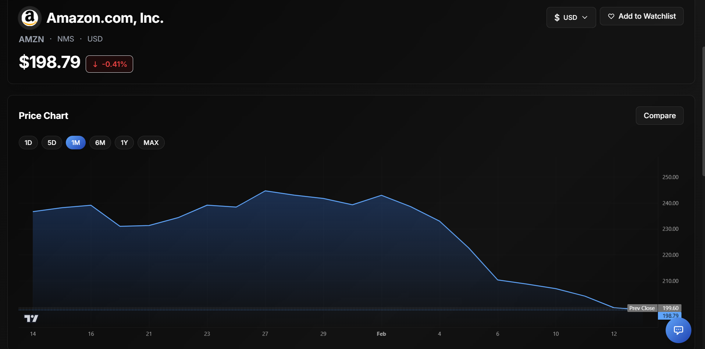

<p align="center"><b>Fig 2:</b> Individual stock intelligence page with interactive charts, statistics, and sector-wise competitor analysis.</p>

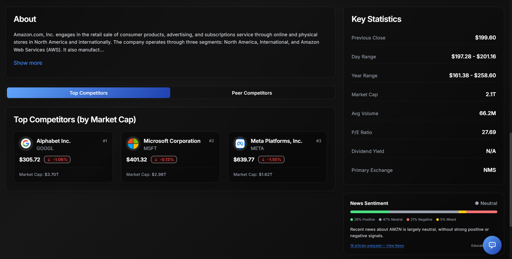

<p align="center"><b>Fig 3:</b> Extended stock view showing AI-driven peer competitors and company context.</p>

#### Purpose

Provides comprehensive stock-level intelligence combining quantitative data with qualitative AI-driven insights.

#### What This Page Shows

- Interactive TradingView price chart with multiple timeframes (1D, 5D, 1M, 6M, 1Y, MAX)
- Company overview, statistics, and business description (via Wikipedia)
- **AI-driven sector-wise peer competitors** — Gemini classifies the company into business sectors and identifies direct competitors per sector
- Top 3 competitors overall (by market cap)
- Competitor mini-charts for quick comparison

---

### AI-Based News Sentiment Analysis

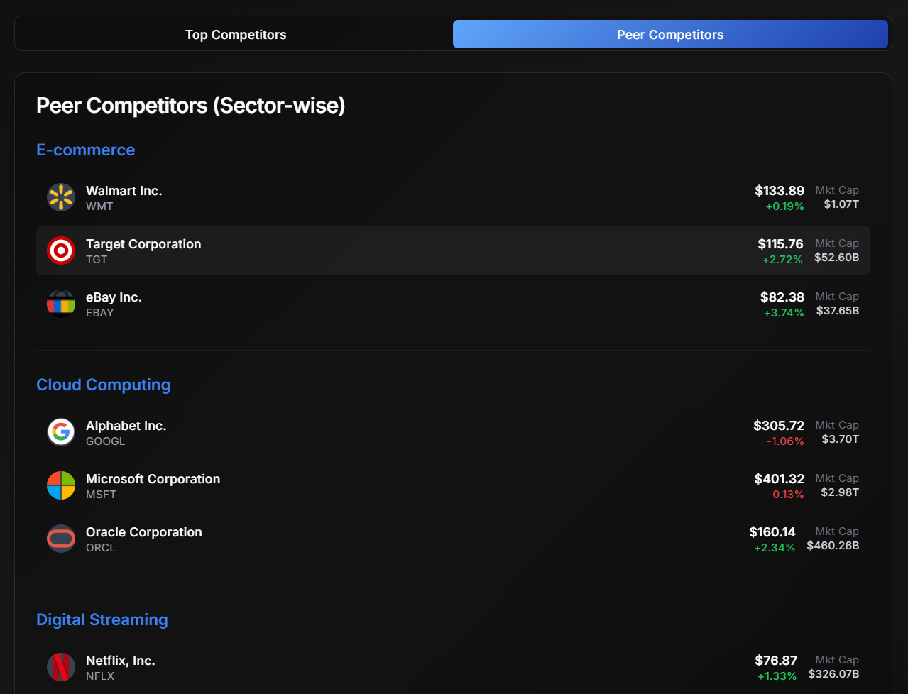

<p align="center"><b>Fig 4:</b> Sentiment distribution showing positive, neutral, and negative financial news classification.</p>

#### How It Works

1. Financial news articles are fetched for the asset
2. Gemini AI classifies articles into positive, neutral, and negative sentiment
3. Distribution percentages are calculated and visualized
4. Divergence detection highlights when sentiment contradicts price movement
5. Users can view categorized articles for transparency

---

### Cryptocurrency Market Dashboard

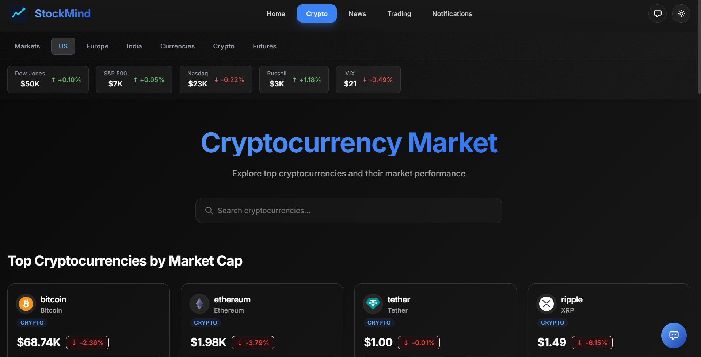

<p align="center"><b>Fig 5:</b> Cryptocurrency market overview displaying top digital assets ranked by market capitalization.</p>

#### What This Page Shows

- Leading cryptocurrencies with live prices and 24h changes
- Market cap, volume, and circulating supply
- Search and filtering functionality
- Click-through to individual crypto detail pages (`/crypto/[id]`) with full chart and stats

---

### Financial News

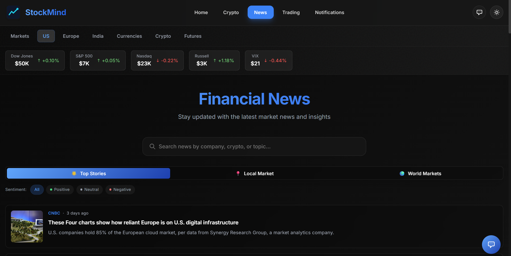

<p align="center"><b>Fig 6:</b> Aggregated financial news dashboard with categorized filtering.</p>

#### What This Page Shows

- Top stories from reputable financial sources (Reuters, Bloomberg, CNBC, WSJ, Economic Times)
- Category-based filtering (company-specific, market-wide, sector, crypto)
- Source attribution and timestamps
- Sentiment indicators per article

---

### Notifications & Budget Explorer

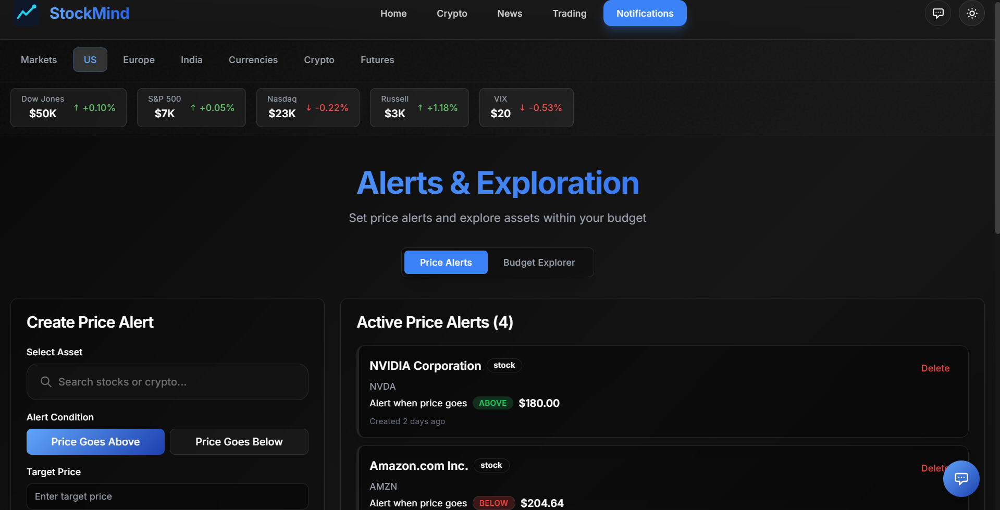

<p align="center"><b>Fig 7:</b> Price alerts and notification management interface.</p>

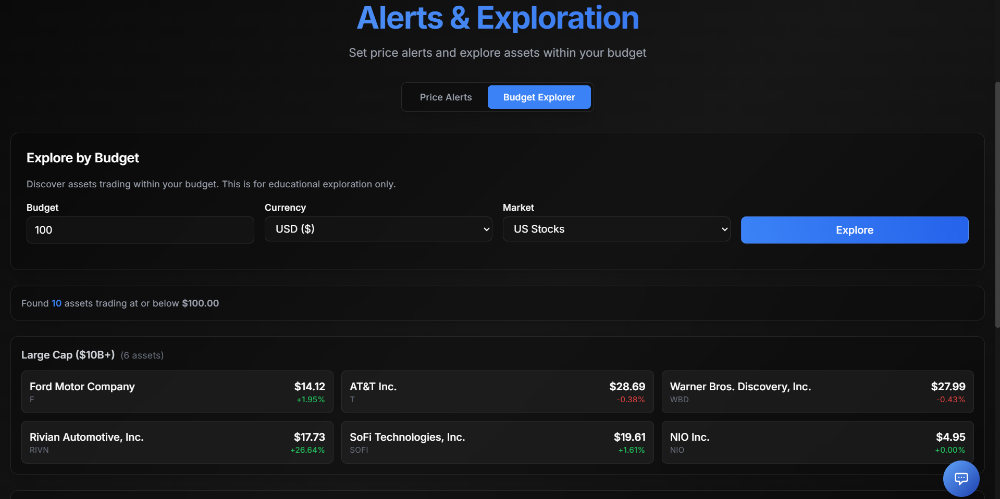

<p align="center"><b>Fig 8:</b> Budget-based asset exploration — discover stocks and crypto within a price range.</p>

#### Price Alerts

- Set price threshold alerts (above/below target price)
- Set percentage movement alerts
- Real-time monitoring with alert deduplication
- User-initiated alerts only — no advisory messaging

#### Budget Explorer

- Input an amount to explore assets trading within that budget
- Results grouped by market cap, sector, and region
- Framed as exploration, not investment advice: *"Assets trading within the selected price range (educational exploration only)"*

---

### AI Financial Assistant (Chatbot)

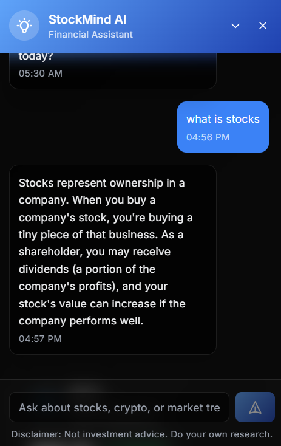

**Fig 9:** Conversational AI assistant powered by Google Gemini.

#### Capabilities

- Explains financial concepts and market terminology
- Provides company business model explanations
- Helps users navigate the platform
- Contextual help based on current page
- **Never** gives buy/sell advice or price predictions

---

## Virtual Trading Module

---

### Trading Dashboard

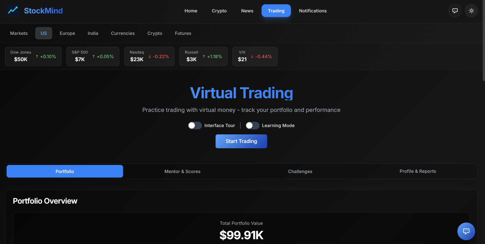

<p align="center"><b>Fig 10:</b> Virtual trading environment with portfolio overview and trading controls.</p>

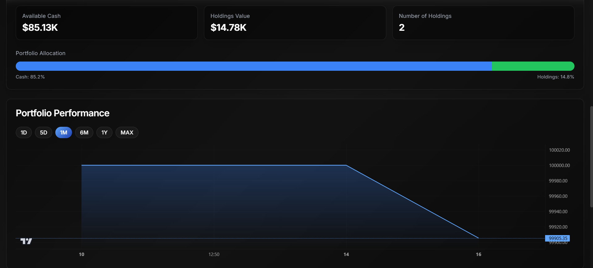

<p align="center"><b>Fig 11:</b> Portfolio performance visualization and holdings breakdown.</p>

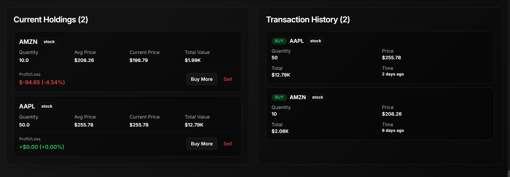

<p align="center"><b>Fig 12:</b> Trade execution interface and transaction history.</p>

#### What This Module Includes

- **Portfolio Management** — $100,000 starting virtual balance, track holdings, P/L, and allocation
- **Trade Execution** — Buy/sell with real-time price locking, capital validation, and transaction history
- **Performance Charts** — Portfolio value over time with configurable time ranges
- **Watchlist** — Track assets of interest with live price updates

---

### Behavioral Performance Scoring

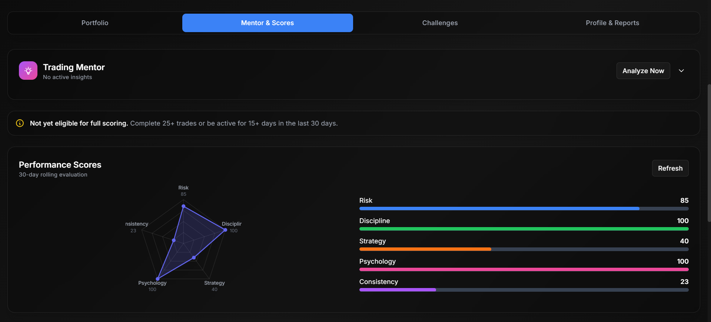

<p align="center"><b>Fig 13:</b> 30-day rolling performance evaluation across behavioral dimensions.</p>

#### Evaluation Dimensions

- Risk Management
- Discipline
- Strategy
- Psychology
- Consistency

Scores are computed using a rolling 30-day evaluation window,ensuring that long-term behavior is measured rather than short-term outcomes or lucky trades, normalized, and visualized with strengths and weaknesses identified.

---

### Challenges & Skill Development

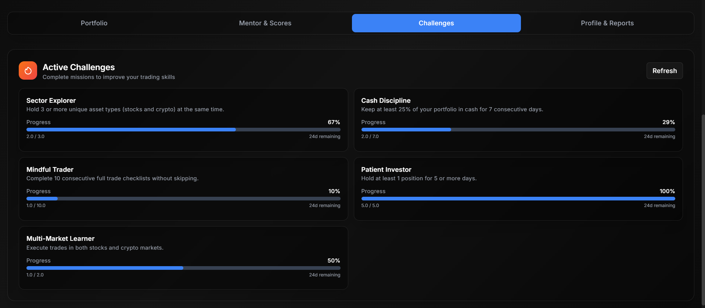

<p align="center"><b>Fig 14:</b> Gamified challenges reinforcing disciplined trading behavior.</p>

#### Example Challenges

- Sector diversification
- Cash discipline
- Mindful trading
- Patient investing
- Multi-market exposure

---

### Trader Profile & Reports


<p align="center"><b>Fig 15:</b> Trader profile with performance reports, badges, and behavior summary.</p>

#### What This Includes

- Trader profile with behavioral classification
- Performance report generation and history
- Achievement badges
- Behavior summary analytics

---

### Adaptive Trading Mentor

#### Purpose

An intelligent behavioral coach that analyzes user trading patterns and provides contextual feedback.

#### Capabilities

- Detects emotional trading patterns
- Identifies risk exposure issues
- Highlights inconsistency in strategy
- Provides actionable improvement suggestions
- Tracks mentor advice history

---

### Trade Journal

- Log reflections on individual trades
- Associate journal entries with specific transactions or symbols
- Review past entries to identify behavioral patterns

---

### Guided Trading Mode

- Step-by-step guided trading workflow for beginners
- Pre-trade checklists to encourage disciplined decision-making
- Checklist completion statistics

---

### Learning Mode

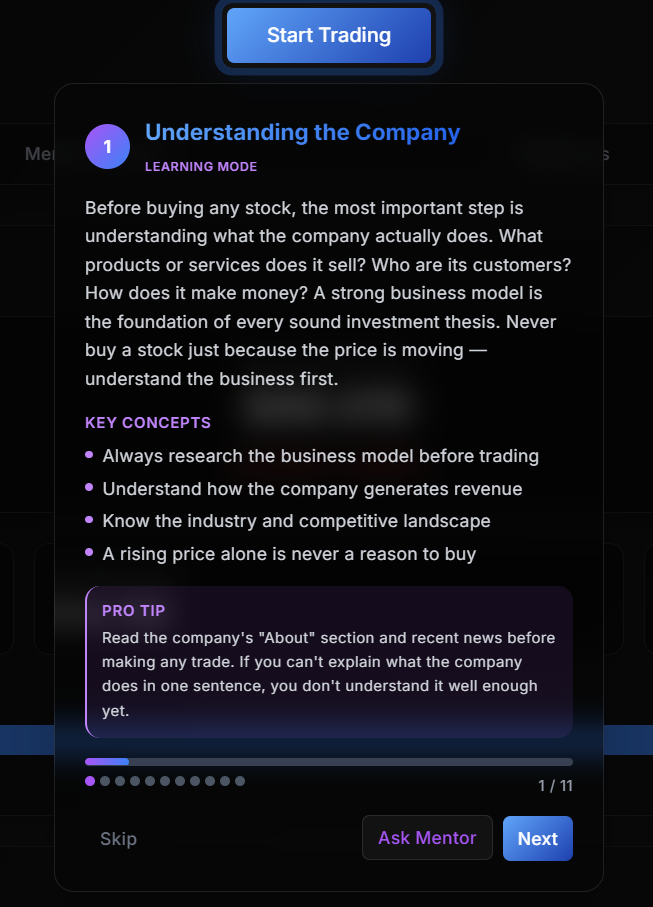

**Fig 16:** Educational modules integrated into the trading workflow.

#### What It Includes

- Concept explanations for investment fundamentals
- Key takeaways and pro tips
- Step-based learning progression

---

### Interface Tour

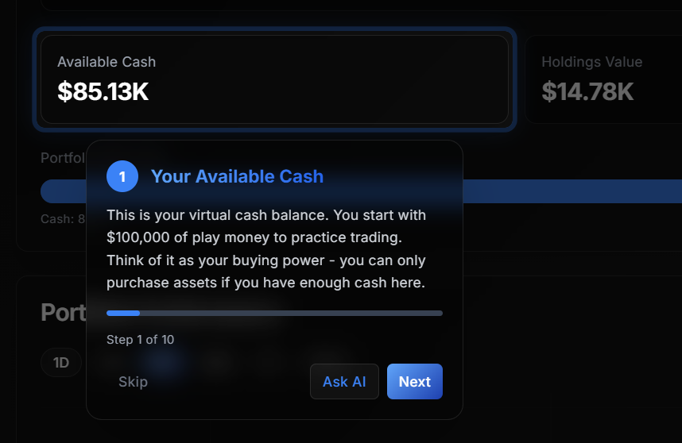

<p align="center"><b>Fig 17:** Guided onboarding explaining platform features step-by-step.

---

### Key Architectural Patterns

- **Proxy pattern** — Next.js API routes proxy all requests to the Python backend, hiding API keys from the client
- **12 React Contexts** — ThemeContext, TradingContext, WatchlistContext, NotificationContext, MarketContext, CurrencyContext, ChatbotContext, MentorContext, EvaluationContext, ChallengesContext, GuidedTradingContext, LearningModeContext
- **Optimistic updates** — Local state updates immediately; SQLite persists in background
- **Aggressive caching** — Backend caches API responses to respect free-tier rate limits
- **Graceful degradation** — Hybrid data sourcing with fallbacks (yfinance → Alpha Vantage → Stooq)

---

## Installation Guide

### Prerequisites

- **Node.js 18+** and npm
- **Python 3.8+** and pip

### Setup

```bash
# Clone the repository
git clone https://github.com/Srajan-V-N/stockmind.git
cd stockmind

# Install frontend dependencies
npm install

# Install Python backend dependencies
pip install -r python/requirements.txt

# Configure environment variables (see next section)
cp .env.example .env
# Edit .env with your API keys

# Start both servers (Next.js + Python FastAPI)
npm run dev
```

The `npm run dev` command uses **concurrently** to start both:
- **Next.js** frontend at `http://localhost:3000`
- **Python FastAPI** backend at `http://localhost:8000`

---

## Environment Configuration

Create a `.env` file in the project root:

```env
# Financial news aggregation
NEWS_API_KEY=your_newsapi_key

# Google Gemini AI (sector classification, chatbot, sentiment)
GEMINI_API_KEY=your_gemini_api_key

# Alpha Vantage (US stock prices, fallback)
ALPHA_VANTAGE_API_KEY=your_alpha_vantage_key

# RapidAPI (Yahoo Finance fallback for Indian stocks)
RAPIDAPI_KEY=your_rapidapi_key
```

---

## Project Structure

```
StockMind/
├── src/
│   ├── app/
│   │   ├── api/               # Next.js API routes (proxy to Python)
│   │   │   ├── stocks/        # Stock search, quote, historical, summary
│   │   │   ├── crypto/        # Crypto search, price, historical, markets
│   │   │   ├── news/          # Financial news
│   │   │   ├── gemini/        # AI chat and classification
│   │   │   ├── competitors/   # AI competitor analysis
│   │   │   ├── sentiment/     # Sentiment analysis and divergence
│   │   │   ├── db/            # Database operations (portfolio, alerts, watchlist)
│   │   │   ├── mentor/        # Adaptive mentor analysis
│   │   │   ├── evaluation/    # Performance scoring and reports
│   │   │   ├── challenges/    # Trading challenges
│   │   │   ├── journal/       # Trade journal
│   │   │   └── fx/            # Currency exchange rates
│   │   ├── stocks/[symbol]/   # Stock detail page
│   │   ├── crypto/[id]/       # Crypto detail page
│   │   ├── news/              # News page
│   │   ├── notifications/     # Alerts & budget explorer
│   │   ├── trading/           # Virtual trading dashboard
│   │   ├── layout.tsx         # Root layout
│   │   └── page.tsx           # Home page
│   ├── components/
│   │   ├── charts/            # TradingView chart components
│   │   ├── chatbot/           # AI assistant overlay
│   │   ├── crypto/            # Crypto-specific components
│   │   ├── home/              # Home page components
│   │   ├── layout/            # Navigation, header, footer
│   │   ├── news/              # News components
│   │   ├── notifications/     # Alert and budget components
│   │   ├── shared/            # Reusable UI elements
│   │   ├── stock/             # Stock detail components
│   │   ├── trading/           # Trading module components
│   │   └── ui/                # shadcn/ui base components
│   ├── contexts/              # 12 React context providers
│   ├── hooks/                 # Custom hooks (useLocalStorage, useRealTimePrices, etc.)
│   ├── lib/                   # Constants, utilities
│   └── types/                 # TypeScript type definitions
├── python/
│   ├── server.py              # FastAPI main server
│   ├── database.py            # SQLite database module
│   ├── stock_data.py          # Stock data fetching logic
│   ├── wikipedia_fetch.py     # Company description fetcher
│   ├── sentiment_engine.py    # Sentiment analysis engine
│   ├── scoring_engine.py      # Behavioral scoring engine
│   ├── mentor_engine.py       # Adaptive mentor logic
│   ├── challenges.py          # Trading challenges logic
│   ├── requirements.txt       # Python dependencies
│   └── stockmind.db           # SQLite database file
├── screenshots/               # Application screenshots
├── package.json
├── next.config.js
├── tailwind.config.ts
├── tsconfig.json
└── README.md
```

---

## Design Principles

- **Light and dark theme** support with system-aware defaults and glassmorphism styling
- Clear separation between exploration, simulation, and evaluation
- Data-driven layout hierarchy with minimal cognitive overload
- Gradient-based visual system with transparent backgrounds for glassmorphism
- Behavioral reinforcement through gamification and challenges
- Structured analytics presentation
- Graceful degradation — partial failures never crash the UI

---

## Disclaimer

StockMind is a **strictly educational platform**. It is designed for learning, exploration, and simulation purposes only.

- All market data is provided for informational purposes
- Virtual trading uses simulated money — no real transactions occur
- The platform does **not** provide investment advice, buy/sell recommendations, or price predictions
- Users should consult qualified financial advisors for real investment decisions

---

## Conclusion

StockMind is a comprehensive financial learning ecosystem integrating:

- **Market Intelligence** — Global stocks, crypto, currencies, and futures with real-time data
- **AI-Driven Analysis** — Gemini-powered sector classification, competitor discovery, and sentiment analysis
- **Behavioral Analytics** — 30-day rolling performance scoring across five psychological dimensions
- **Virtual Trading Simulation** — Full portfolio management with $100K virtual balance
- **Adaptive Mentorship** — Intelligent behavioral coaching based on trading patterns
- **Gamified Skill Development** — Challenges, badges, and trader profiles
- **Budget Exploration** — Discover assets within a price range (educational, not advisory)
- **Price Alerts & Notifications** — User-defined threshold and percentage-based alerts

The platform is designed not only to display financial data, but to cultivate disciplined, informed, and psychologically aware traders through structured evaluation and intelligent feedback.
